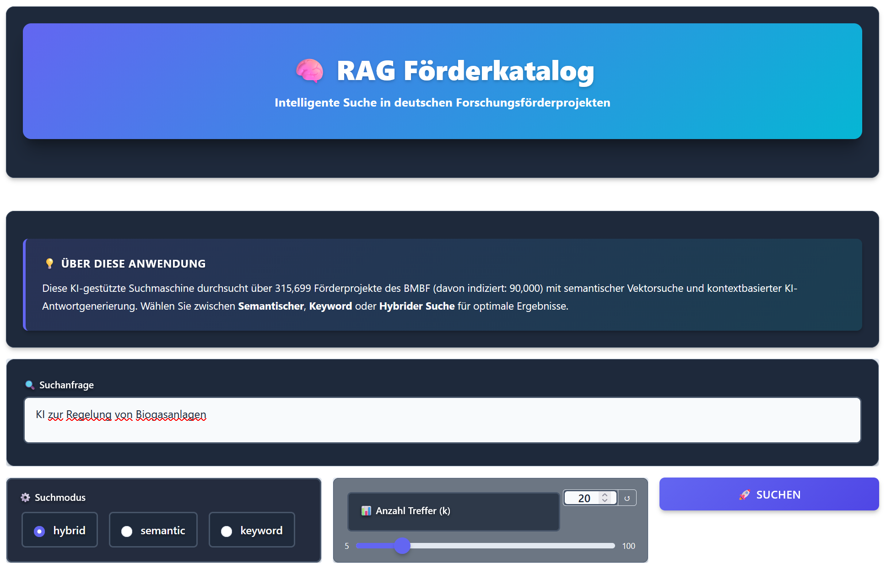
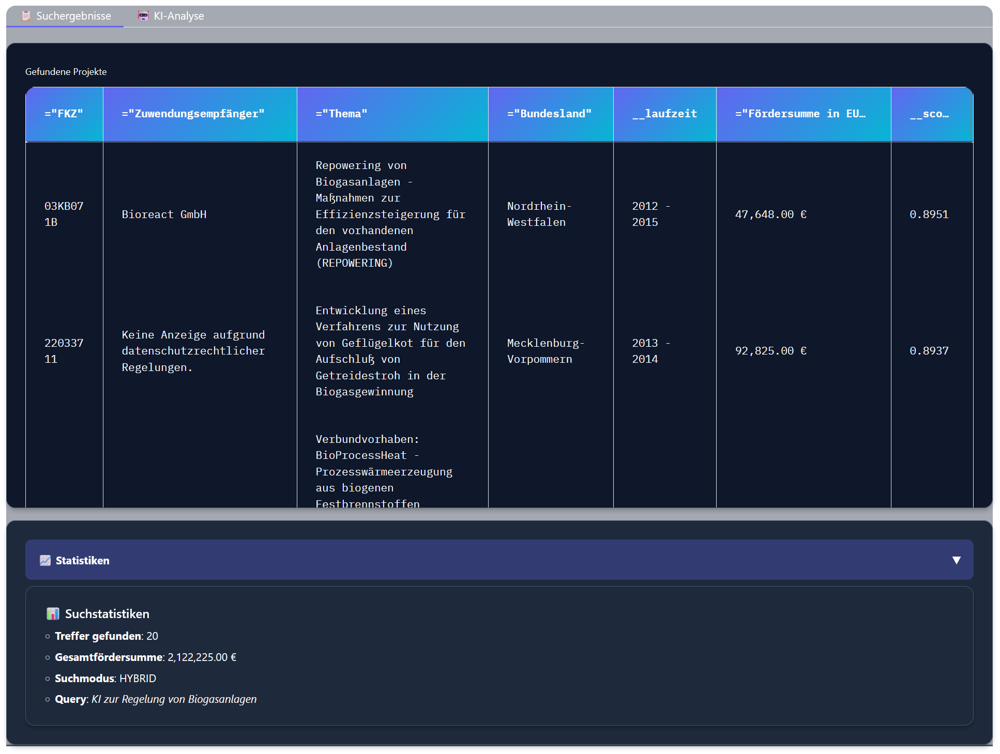
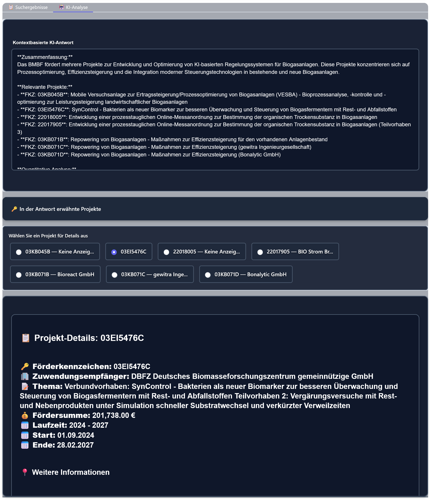

# 🧠 RAG Förderkatalog - Google Colab Notebook

## 📋 Inhaltsverzeichnis

- [Überblick](#überblick)
- [Features](#features)
- [Voraussetzungen](#voraussetzungen)
- [Installation & Start](#installation--start)
- [Nutzung](#nutzung)
- [Screenshots](#screenshots)
- [Technische Details](#technische-details)
- [Häufige Probleme](#häufige-probleme)
- [Lizenz](#lizenz)

---

## Überblick

Das Notebook [`RAG_Foerderkatalog_Colab.ipynb`](RAG_Foerderkatallog_Colab.ipynb) ermöglicht die **einfache Nutzung** der RAG Förderkatalog-Anwendung direkt in **Google Colab** – ganz ohne lokale Installation.

Mit diesem Notebook können Sie:
- ✅ **300.000+ Förderprojekte** des BMBF durchsuchen
- ✅ **Semantische Suche** mit HuggingFace Embeddings nutzen
- ✅ **KI-gestützte Analysen** von Projektdaten erhalten
- ✅ Die moderne **Gradio Web-UI** im Browser verwenden

<p align="center">
  
</p>

---

## Features

### 🔍 Intelligente Suche

- **Drei Suchmodi**:
  - **Semantisch**: KI-basierte Vektorsuche für thematische Ähnlichkeit
  - **Keyword**: Schnelle textbasierte Suche
  - **Hybrid**: Kombination beider Ansätze für optimale Ergebnisse

- **Erweiterte Filterung**: Durchsuchbar nach Bundesland, Zeitraum, Thema und mehr

### 🤖 KI-Analyse

- **Kontextbasierte Antworten** mit Large Language Models (LLMs)
- **Automatische Quellenangaben** mit Förderkennzeichen (FKZ)
- **Statistische Auswertungen**: Anzahl Projekte, Gesamtfördersumme, Zeiträume

### 🎨 Moderne Benutzeroberfläche

- **Gradio Web-UI** mit Dark Theme
- **Responsive Design** optimiert für Browser
- **Interaktive Projekt-Details** per Klick
- **Beispiel-Queries** zum schnellen Ausprobieren

---

## Voraussetzungen

### 📝 Erforderlich

1. **Google-Account** für Colab
2. **API Key** für LLM-Nutzung:
   - **Groq API Key** (empfohlen, kostenlos) *oder*
   - **OpenAI API Key** (kostenpflichtig)

### 🔑 API Keys einrichten

Eine **detaillierte Anleitung** zum Erstellen und Hinterlegen der API Keys finden Sie hier:

👉 **[API Keys für Google Colab einrichten](https://github.com/dgaida/llm_client/blob/master/notebooks/README.md#%EF%B8%8F-api-keys-als-secrets-in-google-colab-hinterlegen)**

**Benötigte Secrets in Colab:**

| Name | Zweck | Pflicht |
|------|--------|---------|
| `GROQ_API_KEY` | Groq LLM API (empfohlen) | ✅ oder OpenAI |
| `OPENAI_API_KEY` | OpenAI API (alternativ) | ✅ oder Groq |

> 💡 **Tipp**: Groq bietet kostenlose API-Nutzung mit Beschränkungen bezüglich tokens-per-day und tokens-per-minute.

---

## Installation & Start

### 1️⃣ Notebook öffnen

Öffnen Sie das Notebook direkt in Google Colab:

[](https://colab.research.google.com/github/dgaida/rag_foerderkatalog/blob/master/notebooks/RAG_Foerderkatallog_Colab.ipynb)

### 2️⃣ API Key hinterlegen

1. Klicken Sie auf das Schlüssel-Symbol 🔑 in der linken Sidebar
2. Fügen Sie Ihren `GROQ_API_KEY` oder `OPENAI_API_KEY` als Secret hinzu
3. Aktivieren Sie "Notebook access" für das Secret

### 3️⃣ Cells ausführen

Führen Sie alle Cells nacheinander aus:

1. **Installation** (~2-3 Minuten)
   - Installiert alle benötigten Python-Pakete
   - Lädt RAG Förderkatalog v0.3.0

2. **Download** (~5-10 Minuten)
   - Lädt Complete Release (~1 GB)
   - Enthält CSV-Daten + vorbereiteten Index

3. **Start der Anwendung** (~1-2 Minuten)
   - Initialisiert die Search Engine
   - Startet Gradio Web-UI

### 4️⃣ Anwendung nutzen

Nach dem Start wird ein **öffentlicher Gradio-Link** generiert:

```
Running on public URL: https://xxxxx.gradio.live
```

Klicken Sie auf diesen Link, um die Anwendung im Browser zu öffnen.

---

## Nutzung

### 🔍 Suche durchführen

1. **Suchmodus wählen**:
   - Hybrid (empfohlen für beste Ergebnisse)
   - Semantic (für thematische Ähnlichkeit)
   - Keyword (für exakte Begriffe)

2. **Suchanfrage eingeben**:
   ```
   Künstliche Intelligenz Hochschule Bayern
   ```

3. **Treffer-Anzahl einstellen** (k-Slider: 5-100)

4. **Auf "🚀 Suchen" klicken**

### 💡 Beispiel-Queries

Das Notebook enthält vorgefertigte Beispiele:

- `Künstliche Intelligenz Hochschule Bayern`
- `Wasserstoff Energie NRW 2020-2025`
- `Quantencomputing Forschung`
- `Klimawandel Digitalisierung`
- `Medizintechnik Berlin`

Klicken Sie einfach auf ein Beispiel zum Übernehmen!

---

## Screenshots

### 📊 Suchergebnisse mit Statistiken

<p align="center">
  
</p>

*Die Ergebnistabelle zeigt gefundene Projekte mit FKZ, Empfänger, Thema, Bundesland, Laufzeit und Fördersumme. Darunter werden statistische Kennzahlen angezeigt.*

### 🤖 KI-Analyse und Projekt-Details

<p align="center">
  
</p>

*Der KI-Analyse-Tab zeigt eine strukturierte Zusammenfassung der Ergebnisse mit Quellenangaben. Über die FKZ-Auswahl können detaillierte Projektinformationen abgerufen werden.*

---

## Technische Details

### 🏗️ Architektur

- **Embedding-Provider**: HuggingFace (`sentence-transformers/all-mpnet-base-v2`)
- **Vektorsuche**: FAISS (CPU-optimiert)
- **LLM-Integration**: GROQ API oder OpenAI API via [LLMClient](https://github.com/dgaida/llm_client)
- **Web-UI**: Gradio 4.0+

### 📊 Datenumfang

- **CSV-Daten**: ~200 MB (inkludiert)
- **Vektorindex**: ~800 MB (vorindiziert)
- **Projekte**: 300.000+
- **Embedding-Dimension**: 768

### ⚡ Performance

- **Suche**: < 3-5 Sekunde
- **LLM-Antwort**: 2-3 Sekunden
- **Index-Validierung**: < 1 Sekunde

### 🔄 Versionen

- **Release**: v0.3.0 (Complete)
- **Python**: 3.11+
- **Colab Runtime**: Standard (kein GPU nötig)

---

## Häufige Probleme

### ❓ "Out of Memory"

**Problem**: Colab Runtime hat nicht genug RAM.

**Lösung**:
1. Runtime neu starten: `Runtime → Restart runtime`
2. Nur benötigte Cells ausführen
3. Upgrade auf Colab Pro für mehr RAM (optional)

### ❓ "API Key ungültig"

**Problem**: GROQ/OpenAI Key ist falsch oder fehlt.

**Lösung**:
```python
# Prüfen Sie Ihren API Key
import os
print(f"GROQ Key gesetzt: {'GROQ_API_KEY' in os.environ}")
print(f"OpenAI Key gesetzt: {'OPENAI_API_KEY' in os.environ}")
```

Erstellen Sie einen neuen Key:
- [Groq Console](https://console.groq.com/keys)
- [OpenAI Platform](https://platform.openai.com/account/api-keys)

### ❓ "Index nicht gefunden"

**Problem**: Download wurde unterbrochen oder ist unvollständig.

**Lösung**:
```python
# Prüfen Sie die Dateien
from pathlib import Path

required_files = [
    'input/foerderkatalog_export.csv',
    'data/vector_hf.index',
    'data/embeddings_map_hf.json'
]

for file in required_files:
    path = Path(f"/content/rag_foerderkatalog_complete_v0.3.0/{file}")
    print(f"{file}: {'✅' if path.exists() else '❌'}")
```

Führen Sie Cell 2 (Download) erneut aus.

### ❓ "Gradio Link funktioniert nicht"

**Problem**: Öffentlicher Link ist abgelaufen.

**Lösung**:
- Gradio-Links sind 72 Stunden gültig
- Führen Sie Cell 3 (Start) erneut aus, um neuen Link zu generieren

---

## 🔗 Weiterführende Ressourcen

### RAG (Retrieval-Augmented Generation)

Mehr über **RAG** erfahren Sie im Notebook-Tutorial zu RAG-Chatbots:

👉 **[RAG Chatbot Tutorial mit LLMClient](https://github.com/dgaida/llm_client/blob/master/notebooks/README.md)**

Dieses Tutorial erklärt:
- 📖 Grundlagen von Retrieval-Augmented Generation
- 🎯 Wie Embeddings und Vektorsuche funktionieren
- 🤖 Integration von LLMs für kontextbasierte Antworten

### Weitere Links

- 📦 [GitHub Repository](https://github.com/dgaida/rag_foerderkatalog)
- 📖 [Projekt-Dokumentation](https://github.com/dgaida/rag_foerderkatalog#readme)
- 🐛 [Issues](https://github.com/dgaida/rag_foerderkatalog/issues)
- 💬 [Discussions](https://github.com/dgaida/rag_foerderkatalog/discussions)
- 🔧 [LLMClient Library](https://github.com/dgaida/llm_client)

### Coursera Kurs

Für ein tieferes Verständnis von RAG empfehlen wir:

📚 [**Retrieval Augmented Generation (RAG)** von DeepLearning.AI](https://www.coursera.org/learn/retrieval-augmented-generation-rag)

---

## 📄 Lizenz

Dieses Notebook ist Teil des Repositories [**dgaida/rag_foerderkatalog**](https://github.com/dgaida/rag_foerderkatalog).

© 2025 – Daniel Gaida, Technische Hochschule Köln
Lizenziert unter der **MIT License**.

---

## 🙏 Credits

- **BMBF** für die Bereitstellung der Förderdaten
- **GROQ** für kostenlose LLM-API
- **HuggingFace** für Embedding-Modelle
- **Gradio** für die Web-UI-Bibliothek

---

**Viel Erfolg bei der Projektsuche! 🚀**
